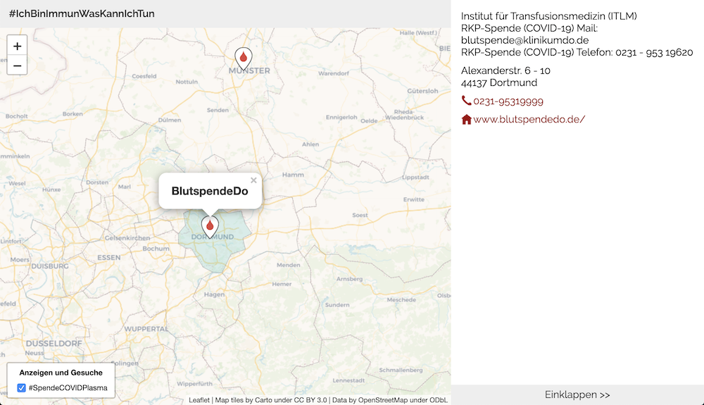

# WirVsVirusMap

Ein gemeinsames Frontend für verschiedene Datenquellen im WirVsVirus Solution Enabler

Map | Status | Link
-----| -----| -----
Demo mit 2 Datenquellen | Hack | [demo.html](https://immunhelden.github.io/WirVsVirusMap/demo.html)
Blutplasmaspende | Preview | [plasma.html](https://immunhelden.github.io/WirVsVirusMap/plasma.html)

# Screenshots

## Development

Erster Entwurf zur [Dokumentation der API](API.md)

Statische [Beispielimplementierung der API](demo_static)
